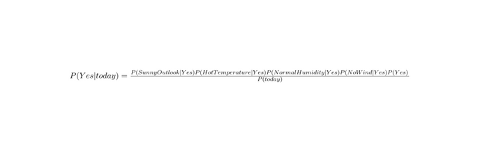

# Denetimli öğrenme sınıflandırma algoritmaları: Naive-Bayes nedir,çalışma mantığı nedir, kullanım alanları, örnekleri

# Denetimli Öğrenim Nedir? 

"Denetimli öğrenim" terimi, bir yapay zeka algoritmasının veri kümesi üzerinde çalışırken, önceden eğitilmiş bir modele dayanarak ve bu modelden alınan yanıtları kullanarak öğrenme sürecini ifade eder. Bu algoritma, veri kümesindeki örneklerin etiketleri veya doğru cevapları bilindiğinde çalışır ve bu bilgileri kullanarak modele öğretilir. Böylece, algoritma, veri kümesinde bulunan yeni örnekleri sınıflandırmak veya tahmin etmek için kullanılabilir.

Denetimli öğrenim algoritması, veri kümesinde bulunan örneklerin etiketleri veya doğru cevapları bilinen bir yapay zeka algoritmasıdır. Bu algoritma, bu bilgileri kullanarak bir model eğitir ve daha sonra bu modele dayanarak veri kümesinde bulunan yeni örnekleri sınıflandırma veya tahmin etme işlemlerini yapar.

Örneğin, bir denetimli öğrenme algoritması, resimlerdeki nesneleri tanımlamak için eğitilebilir. Bu algoritma, resimlerdeki nesnelerin etiketlerini veya doğru cevaplarını bilir ve bu bilgileri kullanarak bir model eğitir. Daha sonra bu modele dayanarak, yeni bir resim görüntülendiğinde, algoritma bu resimdeki nesneyi doğru bir şekilde tanımlayabilir.

Şekildeki örnekte Hexagon, Square, Triangle olarak etiketlenmiş veriler görülmektedir. İlk olarak bu şekilde verilerin bulunduğu bir eğitim seti ile bu model eğitilir. Eğitilen model, test veri seti ile de test edilerek, test veri setinde bulunan şekilleri doğru olarak tahmin etmesi beklenir.

Denetimli öğrenim algoritmaları;

1. Naive Bayes: Bu algoritma, veri kümesinde bulunan örneklerin sınıflandırılması veya tahmin edilmesi işlemlerini yapmak için kullanılan bir yapay zeka algoritmasıdır. Naive Bayes, veri kümesinde bulunan örneklerin etiketlerini veya doğru cevaplarını kullanarak bir model eğitir ve daha sonra bu modele dayanarak, veri kümesinde bulunan yeni örnekleri sınıflandırma veya tahmin etme işlemlerini yapar. Naive Bayes, veri kümesinde bulunan örneklerin özelliklerinin birbirlerinden bağımsız olduğu varsayımına dayanarak çalışır.
2. Nöral Ağlar: Bu algoritma, veri kümesinde bulunan örneklerin sınıflandırılması veya tahmin edilmesi işlemlerini yapmak için kullanılan bir yapay zeka algoritmasıdır. Nöral ağlar, insan beyninin yapısına benzer bir yapıya sahiptir ve bu yapı sayesinde, veri kümesinde bulunan örneklerin sınıflandırılması veya tahmin edilmesi işlemlerini gerçekleştirirler. Nöral ağlar, veri kümesinde bulunan örneklerin etiketlerini veya doğru cevaplarını kullanarak bir model eğitir ve daha sonra bu modele dayanarak, veri kümesinde bulunan yeni örnekleri sınıflandırma veya tahmin etme işlemlerini yapar.
3. Karar Ağaçları: Karar ağaçları, verilerin birleştirilmesi ve dallanması yoluyla bir karar verme mekanizması oluşturmayı amaçlayan bir denetimli öğrenme algoritmasıdır. Örneğin, bir karar ağacı ev sahipliği yapılacak bir parti için en uygun zamanı seçmek için kullanılabilir. Girdi olarak mevsim, hava durumu ve parti için öngörülen katılım sayısı gibi değişkenler verilebilir ve algoritma bu değişkenleri kullanarak en uygun zamanı belirleyebilir.
4. Destek Vektör Makineleri (SVM): Destek vektör makineleri, verileri bir hiperdüzlemde ayrıştıran ve bu ayrışma sonucunda bir sınıflandırma gerçekleştiren bir denetimli öğrenme algoritmasıdır. Örneğin, bir destek vektör makinesi ev sahipliği yapılacak bir parti için en uygun zamanı seçmek için kullanılabilir. Algoritma bu verilere dayanarak ev sahipliği yapılacak zamanı sınıflandırabilir.
5. Rastgele Orman: Rastgele orman, bir grup karar ağacının bir araya gelmesiyle oluşturulan bir denetimli öğrenme algoritmasıdır. Bu algoritma, her bir karar ağacının verilere farklı açılardan bakmasını sağlar ve bu sayede doğruluğu artırılmış bir tahmin yapabilir.
6. Lineer Regresyon: Bu algoritma, veri kümesinde bulunan örneklerin birbirleriyle ilişkisini bulmak ve bu ilişkiyi kullanarak, veri kümesinde bulunan yeni örneklerin tahmin edilmesi işlemlerini yapmak için kullanılan bir yapay zeka algoritmasıdır. Lineer regresyon, veri kümesinde bulunan örneklerin etiketlerini veya doğru cevaplarını kullanarak bir model eğitir ve daha sonra bu modele dayanarak, veri kümesinde bulunan yeni örneklerin tahmin edilmesi işlemini yapar. Lineer regresyon, örnekler arasındaki ilişkiyi bir doğruya yakın bir şekilde ifade etmeyi hedefler.
7. Logistic Regresyon: Bu algoritma, veri kümesinde bulunan örneklerin sınıflandırılması veya tahmin edilmesi işlemlerini yapmak için kullanılan bir yapay zeka algoritmasıdır. Logistic regresyon, veri kümesinde bulunan örneklerin etiketlerini veya doğru cevaplarını kullanarak bir model eğitir ve daha sonra bu modele dayanarak, veri kümesinde bulunan yeni örnekleri sınıflandırma veya tahmin etme işlemlerini yapar. Logistic regresyon, örneklerin sınıflandırılması veya tahmin edilmesi işlemini, örneklerin birbirleriyle olan ilişkisini bir logaritmik doğruya yakın bir şekilde ifade ederek gerçekleştirir.

Denetimli öğrenim algoritmalarının kullanım alanlarına dair günlük hayattan örnekler;

- Spam e-posta filtreleme: Bir e-posta istemcisi (Outlook, Gmail vb.), gelen e-posta mesajlarını otomatik olarak spam veya değil spam olarak sınıflandırır. Bu sınıflandırma, denetimli öğrenim algoritmaları kullanılarak yapılır.
- Öneri sistemleri: Bir e-ticaret sitesi (Amazon, eBay vb.), kullanıcıların daha önce satın aldıkları veya inceledikleri ürünlerden yola çıkarak, kullanıcılara ürün önerileri yapar. Bu öneriler, denetimli öğrenim algoritmaları kullanılarak hesaplanır.
- Sağlık takipleri: Bir sağlık uygulaması (Fitbit, Apple Health vb.), kullanıcının günlük aktivitelerini (adım sayısı, kalori harcaması vb.) takip eder ve bu veriler kullanılarak kullanıcının sağlık durumunun tahmin edilmesine yardımcı olur. Bu tahminler, denetimli öğrenim algoritmaları kullanılarak yapılır.
- Ses tanıma: Bir ses tanıma uygulaması (Google Assistant, Siri vb.), kullanıcının söylediği kelimeleri tanıyarak bu kelimeleri metne dönüştürür. Bu tanıma, denetimli öğrenim algoritmaları kullanılarak yapılır.
- Görüntü tanıma: Bir görüntü tanıma uygulaması (Google Görüntü Tanıma, Microsoft Cognitive Services vb.), verilen bir görüntüde bulunan nesneleri tanıyarak bu nesneleri adlandırır. Bu tanıma, denetimli öğrenim algoritmaları kullanılarak yapılır.
- Yüz tanıma: Bir yüz tanıma uygulaması (Facebook, Google Photos vb.), verilen bir görüntüde bulunan yüzleri tanıyarak bu yüzleri kişilere eşleştirir. Bu tanıma, denetimli öğrenim algoritmaları kullanılarak yapılır.
  
  ## Bayes Teoremi
  
  Bayes Teoremi, bir olayın gerçekleşme olasılığını belirlemek için kullanılan bir matematiksel kavramdır. Bu teoremin kullanımı, bir olayın gerçekleşme olasılığının, olayın belirli bir koşula bağlı olarak gerçekleşme olasılığının değişimi ile ilgilidir. Örneğin, bir insanın grip olma olasılığının, insanın grip aşısı yaptırıp yaptırmadığına bağlı olarak değiştiğini düşünün. Bayes Teoremi, bu değişimin nasıl hesaplanacağını açıklar.

Bayes Teoremi, Thomas Bayes tarafından geliştirilmiştir ve 1763 yılında yayınlanmıştır. Bu teorem, başlangıçta teoloji ve filozofide kullanılmış, ancak daha sonra diğer alanlarda da kullanılmaya başlanmıştır. Özellikle makine öğrenimi ve istatistik alanlarında sıklıkla kullanılmaktadır.
  
  

    
  Bayes Teoremi, bir olayın gerçekleşme olasılığını belirlemek için iki temel koşula dayanır. Bunlar, olayın koşullu olasılığı ve olayın koşulsuz olasılığıdır. Koşullu olasılık, bir olayın belirli bir koşula bağlı olarak gerçekleşme olasılığıdır. Örneğin, insanın grip olma olasılığının grip aşısı yaptırıp yaptırmadığına bağlı olarak değiştiğini düşündüğümüzde, grip aşısı yaptıran insanların grip olma olasılığı koşullu olasılık olarak adlandırılır. Koşulsuz olasılık ise bir olayın koşul olmaksızın gerçekleşme olasılığıdır. Örneğin, insanların grip olma olasılığı koşulsuz olasılık olarak adlandırılır.

Bayes Teoremi, koşullu olasılık ve koşulsuz olasılığı birleştirerek bir olayın gerçekleşme olasılığını belirleyen bir matematiksel ifadedir. Örneğin, grip aşısı yaptıran insanların grip olma olasılığını (P(A|B)) belirlemek istersek, Bayes Teoremi'ni kullanabiliriz. Bu durumda, Bayes Teoremi'ni şu şekilde kullanabiliriz:

P(A|B) = P(B|A) * P(A) / P(B)

Burada, P(A|B) grip aşısı yaptıran insanların grip olma olasılığını, P(B|A) grip olma olasılığının grip aşısı yaptırıp yaptırmadığına bağlı olarak değiştiğini, P(A) grip aşısı yaptırma olasılığını ve P(B) grip olma olasılığını göstermektedir.

Bayes Teoremi, bir olayın gerçekleşme olasılığını belirlemek için kullanılan önemli bir matematiksel kavramdır. Özellikle makine öğrenimi ve istatistik alanlarında sıklıkla kullanılmaktadır. Bu teorem sayesinde, verileri kullanarak bir olayın gerçekleşme olasılığını belirleyebilir ve bu sayede doğruluğu artırılmış tahminler yapabiliriz.
    

      
  
*P ( A | B )* = B olayı gerçekleştiğinde A olayının gerçekleşme olasılığı
*P ( A )* = A olayının gerçekleşme olasılığı
*P ( B | A )* = A olayı gerçekleştiğinde B olayının gerçekleşme olasılığı
*P ( B )* = B olayının gerçekleşme olasılığı
    
## Naive Bayes
      
  Naive Bayes sınıflandırma algoritması bir sınıflandırma yöntemidir. Bu algoritma, verilen bir girdi olayının hangi sınıfa ait olduğunu belirlemek için kullanılır. Algoritma, olasılık teoremine dayanarak çalışır ve verilen bir olayın sınıfına ait olma olasılığını hesaplar. Daha sonra en yüksek olasılığa sahip sınıfı seçer ve bu sınıfa atar.

Naive bayes sınıflandırma algoritması, diğer sınıflandırma yöntemlerinden farklı olarak, girdi olaylarının her bir özelliğini bağımsız olarak değerlendirir. Bu nedenle algoritma "naive" (saf) bayes olarak adlandırılır. Bu yöntem, veri kümelerinde çok sayıda özellik olması durumunda daha hızlı çalışabilir.

Algoritmanın çalışma prensibi şu şekildedir: Öncelikle, veri kümesinde bulunan tüm olayların sınıfları bilinir. Daha sonra, her bir olayın her bir özelliği için olasılık değerleri hesaplanır. Bu hesaplamalar, veri kümesinde bulunan tüm olayların sınıf dağılımlarına göre yapılır.

Örneğin, bir veri kümesinde "hava durumu" ve "oyun durumu" gibi iki özellik bulunabilir. Bu veri kümesinde, her bir hava durumunun (güneşli, yağmurlu vb.) ve her bir oyun durumunun (kazanılan, kaybedilen vb.) olasılık değerleri hesaplanır. Daha sonra, bu olasılık değerleri kullanılarak verilen bir girdi olayının hangi sınıfa ait olma olasılığı hesaplanır. En yüksek olasılığa sahip sınıf seçilerek olay bu sınıfa atanır.

Naive bayes sınıflandırma algoritması büyük veri kümeleri için oldukça etkili bir yöntem değildir. Bu algoritma, veri kümesinde bulunan özellikler arasındaki ilişkileri hesaba katmaz. Bu nedenle, büyük veri kümelerinde başarı oranı düşük olabilir. Ancak, algoritma hızlı çalışır ve küçük veri kümeleri için iyi sonuçlar verir.

Naive bayes sınıflandırma algoritması, genellikle spam e-posta filtreleme, doküman sınıflandırma ve haber makalelerinin kategorilere ayırılması gibi uygulamalarda kullanılır. Örneğin, bir spam e-posta filtreleme sisteminde, bir e-posta mesajının spam olma olasılığı hesaplanır ve en yüksek olasılığa sahip sınıfa atanır. Bu sayede spam e-postalar ayıklanabilir.
      
## Naive Bayes Algoritmasının Avantajları 
      
- Naive-Bayes algoritması, basit bir yapıya sahiptir ve bu yapı sayesinde kullanımı kolaydır.
- Naive-Bayes algoritması, veri kümelerindeki değişikliklere kolayca adapte olabilir ve bu sayede modelini güncel tutabilir.
- Naive-Bayes algoritması, bulut bilişim teknolojileri gibi büyük veri ortamlarında kullanımı kolaydır.
- Her özellik birbirinden bağımsız kabul edildiği için logistic regresyon gibi modellerden daha iyi performans gösterebilir.
- Az veriyle iyi işler başarabilir.
- Sürekli ve kesikli veriler ile kullanılabilir.
      
## Naive Bayes Algoritmasının Dezavantajları 
      
- Naive-Bayes algoritması, her bir özelliğin diğer özelliklerden bağımsız olduğu varsayımına dayanır. Bu varsayım, genellikle doğru değildir ve algoritmanın tahminlerinin yanlış olma riskini doğurabilir.
- Naive-Bayes algoritması, sadece kategorik ve sayısal verileri işleyebilir. Bu nedenle, çok büyük ve karmaşık veri türlerini işleyemez ve kullanımı sınırlıdır.
- Sıfır olasılık problemi ile karşı karşıya kalabilirsiniz. Sıfır olasılık istediğimiz örneğin veri setinde hiç bulunmaması durumudur. Yani herhangi bir işleme alındığında sonucu sıfır yapacaktır. Bunun için en basit yöntem tüm verilere minimum değer ekleyerek (genellikle 1) bu olasılık ortadan kaldırılabilir. Bu duruma Laplace kullanılarak tahminleme de denmektedir.
      
## Naive Bayes Algoritması Çeşitleri
      
**Gaussian Naive-Bayes:** Bu tür, sayısal verileri işleyebilen bir Naive-Bayes türüdür. Gaussian Naive-Bayes, her bir özelliğin dağılımının normal dağılım (Gaussian) olduğu varsayımına dayanır ve bu varsayım doğrultusunda tahminler yapar. 

**Multinomial Naive-Bayes:** Bu tür, kategorik verileri işleyebilen bir Naive-Bayes türüdür. Multinomial Naive-Bayes, her bir özelliğin sınıflandırılması için kategorik olarak gruplandırıldığı varsayımına dayanır ve bu varsayım doğrultusunda tahminler yapar. 

**Bernoulli Naive-Bayes:** Bu tür, iki kategorik değerden (örneğin, "var" ve "yok") oluşan verileri işleyebilen bir Naive-Bayes türüdür. Bernoulli Naive-Bayes, her bir özelliğin iki kategorik değer içerdiği varsayımına dayanır ve bu varsayım doğrultusunda tahminler yapar.
      
## Naive Bayes Algoritmasının Çalışma Mantığı 
      
Naive Bayes'in çalışma mantığı, Bayes teoremiyle ilgilidir. Bayes teoremi, verilen bir olayın gerçekleşme olasılığını belirli bir bilgiye göre hesaplamaya yarayan bir matematiksel kuraldır. Naive Bayes ise bu kuralı kullanarak veri kümesinde bulunan örneklerin sınıflarına göre öğrenme yapar.

Not: Test kümesindeki bir değerin eğitim kümesinde gözlemlenemeyen bir değeri varsa olasılık değeri olarak 0 verir yani tahmin yapamaz. Bu durum genellikle Zero Frequency ( Sıfır Frekans ) adıyla bilinir. Bu durumu çözmek için düzeltme teknikleri kullanılabilir. En basit düzeltme tekniklerinden biri Laplace tahmini olarak bilinir.
      

  
Yukarıdaki tablo örnek gösterilirse, her bir öznitelik ve her bir özniteliğin farklı değerleri için ”Play Golf” kolonundaki yes ve no değerleri oranına bakılır. Bu oranlar bayes teoremindeki yerlerine konularak gerekli işlemler yapılır ve sonucu yüksek gelen seçenek seçilir.
  
## Naive Bayes Algoritmasının Kullanım Alanları
  
- Spam e-posta filtreleme: Bir spam e-posta filtreleme sistemi, e-posta mesajlarını spam veya değil spam olarak sınıflandırır. Bu sınıflandırma, naive bayes algoritması kullanılarak yapılır.
- Doküman sınıflandırma: Bir belge yönetim sistemi, belgeleri kategorilere göre sınıflandırır. Bu sınıflandırma, naive bayes algoritması kullanılarak yapılır.
- Haber makalelerinin kategorilere ayırılması: Bir haber sitesi, makalelerini belirli kategorilere göre sınıflandırır. Bu sınıflandırma, naive bayes algoritması kullanılarak yapılır.
- Naive Bayes sınıflandırıcısı, veri madenciliği ve benzeri alanlarda sınıflandırma görevlerinde etkili bir yöntemdir.
- Naive Bayes, biyomedikal mühendislik ve hastalık ya da anormalliklerin tıbbi tanımlanmasında kullanılabilir.
- Ayrıca, elektrokardiyografi ve elektroensefalografi grafiklerinin sınıflandırılmasında ve ayrıştırılmasında, genetik araştırmalarında da kullanılır.
  
## Naive Bayes Örnek Uygulama
  
Aşağıdaki durumlar gözlemlenerek, Outlook: Sunny Temperature: Hot Humidity: Normal Windy: False olduğu koşullarda Play Golf = ?
  

  

  
Burada her bir öznitelikteki durumlar için, “Play Golf” sınıfındaki karşılıkları gözlemlenir. 

İlk olarak yapılması gereken “Play Golf” taki “Yes” ve “No” sınıflarıdır. İlk olarak bu sınıfların oranı gözlemlenir. Gördüğüm tabloda “Yes” oranı 9/14, “No” oranı ise “5/14” olarak bulunmuştur.

Daha sonra ise her bir öznitelikteki farklı durumlar için P(Yes) ve P(No) durumları gözlemlenir ve bunlar oranlanır. Bu işlem her bir öznitelikteki her bir durum için ayrı ayrı yapılır.
  

    
İlk olarak istenilen durumlar için “Yes” oranları alınır ve yukarıdaki işlem yapılır.
  

  
Daha sonra ise aynı işlem “No” oranları için yapılır.
  

  
İşlem sonuçları bu şekilde bulunur.
    

  
Daha sonrasında P(Yes)/(P(Yes)+P(No)) ve P(No)/(P(Yes)+P(No)) işlemleri yapılır ve sonuçları gözlemlenir. Gözlemlenen sonuçlarda P(Yes) daha yüksek çıktığı için Play Golf = Yes sonucu bulunur.
  
## Zero Frequency Sorunu İçin Laplace Düzeltmesi Örneği
  

  
Bu örnekte ise Spam = Yes ve Spam = No sınıflarından hangisine ait olduğunu çözmek için işlemler yapılıyor. TimeZone = EU için 0 sonucu alındığı için her bir öznitelik için pay ve paydaya eklemeler yapılır. Ve süreç baştan başlatılır. Bu olaya ise Laplace Düzeltmesi adı verilir.

## Kaynakça

- [https://www.ibm.com/tr-tr/cloud/learn/machine-learning](https://www.ibm.com/tr-tr/cloud/learn/machine-learning)
- [https://www.linkedin.com/pulse/alogoritmik-düşünme-denetimli-denetimsiz-ve-takviyeli-enes-öndeş/?originalSubdomain=tr](https://www.linkedin.com/pulse/alogoritmik-d%C3%BC%C5%9F%C3%BCnme-denetimli-denetimsiz-ve-takviyeli-enes-%C3%B6nde%C5%9F/?originalSubdomain=tr)
- [https://www.ibm.com/cloud/learn/supervised-learning](https://www.ibm.com/cloud/learn/supervised-learning)
- [https://medium.com/@ekrem.hatipoglu/machine-learning-classification-naive-bayes-part-11-4a10cd3452b4](https://medium.com/@ekrem.hatipoglu/machine-learning-classification-naive-bayes-part-11-4a10cd3452b4)
- [https://www.matematiksel.org/bayes-teoremi-nedir-bu-teoremin-kotuye-kullanimi-neden-tehlikelidir/](https://www.matematiksel.org/bayes-teoremi-nedir-bu-teoremin-kotuye-kullanimi-neden-tehlikelidir/)
- https://chat.openai.com/chat
- https://www.geeksforgeeks.org/naive-bayes-classifiers/

